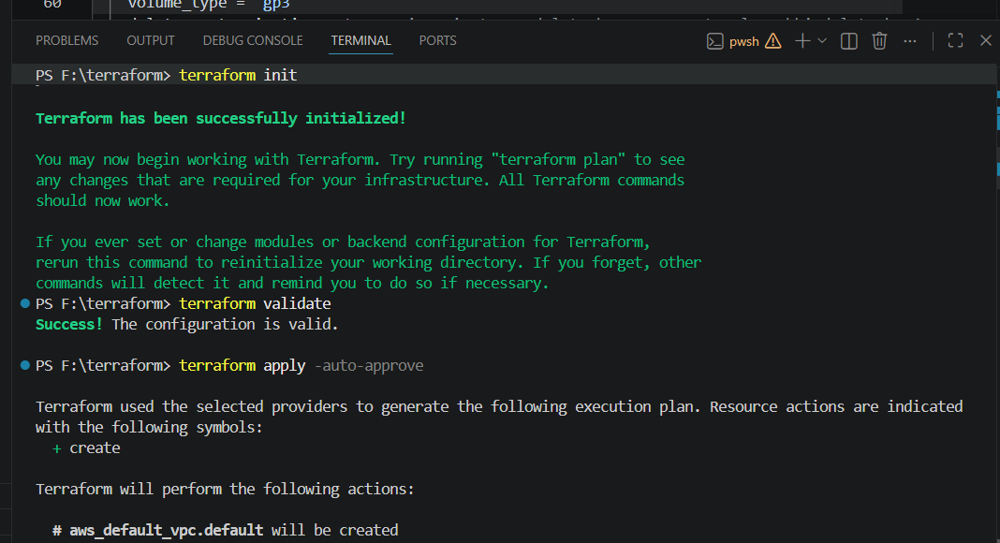

# creating-aws-ec2-instance-with-terraform-script-
maine isme hashicorp configuration language ka use krke terraform ka use aws ec2 ko connect kiya everything i do is done by using terrraform dicumentation and perfectly explained the each step with comments in my style 

# 🚀 AWS EC2 Instance Creation using Terraform

Ye project Terraform ka use karke AWS par EC2 Instance automate tareeke se create karne ke liye banaya gaya hai.  
Is project ki help se aap Infrastructure as Code (IaC) concept ko practically samajh sakte ho.

---

# 📌 Project Overview

Is project me humne:

- Terraform install kiya
- AWS Provider configure kiya
- AWS credentials setup kiye
- SSH Key Pair generate ki
- Terraform script likhkar EC2 instance create kiya
- GitHub par project upload kiya
- Terraform destroy command se resources remove kiye

---

# 🛠 Technologies Used

- Terraform
- AWS EC2
- PowerShell
- Git & GitHub
- VS Code

---

# 📂 Project Structure

```bash
.
├── terraform.tf
├── provider.tf
├── ec2.tf
├── .gitignore
├── my_key
├── my_key.pub
├── terraform.tfstate
├── terraform.tfstate.backup
└── README.md
```

---

# ⚙️ Prerequisites

Project run karne se pehle system me ye cheeze installed honi chahiye:

- AWS Account
- Terraform
- AWS CLI
- Git
- VS Code

---

# 🔽 Step 1: Install Terraform

Terraform download karo:

https://developer.hashicorp.com/terraform/downloads

Apne system architecture ke according version download karo:

- Windows AMD64 → Intel/AMD Processor
- Windows ARM64 → ARM Processor

Install verify karne ke liye:

```powershell
terraform --version
```

---

# 🔑 Step 2: Configure AWS Credentials

PowerShell me command run karo:

```powershell
aws configure
```

Phir:
- AWS Access Key
- Secret Access Key
- Region
- Output Format

enter karo.

---

# 🔐 Step 3: Generate SSH Key Pair

PowerShell me:

```powershell
ssh-keygen -t rsa
```

Isse:
- Private Key → `my_key`
- Public Key → `my_key.pub`

generate hogi.

---

# 📝 Step 4: Write Terraform Configuration

## AWS Provider Configuration

```hcl
provider "aws" {
  region = "us-east-1"
}
```

## EC2 Instance Resource

```hcl
resource "aws_instance" "mera_ec2_instance" {
  ami           = "ami-05f0fd22e"
  instance_type = "t3.micro"
}
```

---

# 🚀 Step 5: Initialize Terraform

Terraform initialize karne ke liye command run karo:

```powershell
terraform init
```

Ye command:
- AWS provider download karti hai
- Terraform project initialize karti hai

---

## 📸 Terraform Init Output


```

---

# ✅ Step 6: Validate Terraform Configuration

Configuration validate karne ke liye:

```powershell
terraform validate
```

Ye check karta hai ki Terraform configuration sahi hai ya nahi.

---

## 📸 Terraform Validate Output


.png)


---

# 📋 Step 7: Preview Infrastructure using Terraform Plan

Infrastructure preview karne ke liye:

```powershell
terraform plan
```

Ye dikhata hai ki kaun-kaun se resources create hone wale hain.

---

## 📸 Terraform Plan Output


.png)


---

# ⚡ Step 8: Create EC2 Instance using Terraform Apply

AWS par EC2 instance create karne ke liye:

```powershell
terraform apply -auto-approve
```

Ye command:
- VPC create karti hai
- Security Group create karti hai
- Key Pair attach karti hai
- EC2 instance launch karti hai

---

## 📸 Terraform Apply Output


.png)


---

# 🌐 AWS Console Outputs

## 📸 Security Group Created


.png)


---

## 📸 EC2 Instance Running


.png)


---

# 🗑 Step 9: Destroy Infrastructure using Terraform Destroy

Infrastructure delete karne ke liye:

```powershell
terraform destroy -auto-approve
```

Ye command:
- EC2 instance delete karti hai
- Security group remove karti hai
- Key pair remove karti hai
- Infrastructure clean kar deti hai

---

## 📸 Resources Before Destroy


.png)


---

## 📸 Terraform Destroy Running


---

## 📸 Terraform Destroy Complete

```
.png)
```

---

# 📌 Important Terraform Files

| File | Purpose |
|------|----------|
| terraform.tf | Main Infrastructure Code |
| provider.tf | AWS Provider Configuration |
| ec2.tf | EC2 Instance Resource |
| .terraform | Provider Cache Folder |
| terraform.tfstate | Infrastructure State File |

---

# 🚫 Files Ignored using .gitignore

```gitignore
.terraform/
*.tfstate
*.tfstate.backup
terraform.tfvars
my_key
*.pem
```

In files ko GitHub par upload nahi karna chahiye because:
- Inme sensitive data ho sakta hai
- Provider files bahut large hoti hain
- Private SSH keys secure rehni chahiye

---

# 🌐 GitHub Repository

Repository Link:

https://github.com/Paras9069/creating-aws-ec2-instance-with-terraform-script-

---

# 📚 Learning Outcomes

Is project se aapne seekha:

- Infrastructure as Code (IaC)
- Terraform Basics
- AWS EC2 Automation
- GitHub Project Management
- SSH Key Pair Generation
- Terraform State Management
- Infrastructure Deployment and Destruction

---

# 👨‍💻 Author

Paras

---

# ⭐ Conclusion

Terraform cloud infrastructure automation ko easy banata hai.  
Is project ki help se AWS resources ko manually create karne ki jagah automated tareeke se manage kiya ja sakta hai.

Ye project beginners ke liye Terraform aur AWS automation seekhne ka ek practical example hai.
